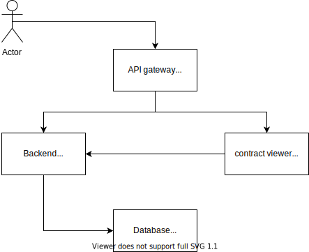

# Обозреватель цепочки блоков

## Описание
Домашняя работа, 
посвященная изучению микросервисной архитектуры, 
выполняемая в рамках курса«Архитектор программного обеспечения»

## Постановка задачи

### Общая
Разработать сервис, позволяющий пользователю хранить кошельки и отслеживать баланс своего кошелька, 
представленный как разница полученых доходов и списанных расходов для принадлежащих пользователю адресов 

### В рамках первой части домащней работы
Разработать сервис, имеющий следующие возможности:
* регистрация пользователя
* аутентификация пользователя
* создание кошелька пользователя
* получение списка кошельков пользователя

### В рамках третьей части домащней работы
Разработать отдельный сервис загрузчик (Loader),
соединить с сервисом ответчиком (Backend) через шину межвзаимодействия (Bus)
и вывести концевые точки для получения баланса и порождение монет 
в сервис ответчик (Backend)

Сервис загрузчик должен иметь следующие возможности
* Получение блоков из корневого узла цепочки блоков
* Сохранение блоков в ключ-значение хранилище
* Подсчет баланса для заданного адреса
* Порождение основных монет в корневого узла для заданного адреса

### В рамках пятой части домащней работы
Разработать сервис фронтальной части (Frontend),
наладить основное одностороннее получение данных с сервиса ответчика (Backend) 
и обеспечить получение уведомлений с сервиса ответчика (Backend)

Сервис фронтальной части должен обеспечивать следующие возможности:
* Регистрация пользователя
* Вход пользователя
* Добавление кошелька пользователя
* Отображение кошельков пользователя
* Отображение баланса в рельном времени

## Архитетура проекта



Backend отвечает за формирование ответов на запросы.

Fronend отвечает за отображение фронтальной части сервиса.

Loader отвечает за выгрузку блоков из корневых узлов цепочки блоков (blockchain)

Bus представляет из себя шину межвзаимодействия.

Bitcoin Server представляет из себя корневой узел цепочки блоков.

Contract viewer отвечает за отображение контракта Backend'а.

Database отвечает за хранение кошельков пользователей.


## Описание контрактов

Запуск сервиса просмотра контракта

```
    docker-compose down
    docker-compose up gateway
```

Запущенный сервис отображения контракта находится по адресу `http://localhost/swagger/`.

## Выполнение ручной проверки

### Предварительные действия

Запуск сервисов обозревателя
```
    docker-compose down
    docker-compose up backend loader frontend
```

установка http клиента (нет никаких препятствий для использования cUrl)
```
    apt-get install httpie
```

### Cоздание и получения кошелька
```
    http --session=backend -v http://localhost/signup email=user@site.net password=12345678

    http --session=backend -v http://localhost/signin email=user@site.net password=12345678

    http --session=backend -v http://localhost/wallets address=2NEmNpj2iW7xGw6ndUpZNrAeRz765PStNGP

    http --session=backend -v http://localhost/wallets 
```

### Проверка баланса
```
    http --session=backend -v http://localhost/balance address=2NEmNpj2iW7xGw6ndUpZNrAeRz765PStNGP 
```

### Порождение монет для заданного кошелька и получение его баланса

```
    http --session=backend -v http://localhost/generate address=2NEmNpj2iW7xGw6ndUpZNrAeRz765PStNGP 
    
    http --session=backend -v http://localhost/balance address=2NEmNpj2iW7xGw6ndUpZNrAeRz765PStNGP 
```

### Получение баланса кошелька в реальном времени

откройте в обозревателе адрес лицевой части сервиса

```
    chrome http://localhost:3000/
```

зарегистрируйтесь, войдите и добавьте желаемый кошелек, например 2NEmNpj2iW7xGw6ndUpZNrAeRz765PStNGP

выполните порождение монет для желаемоего кошелька 
```
    http --session=backend -v http://localhost/generate address=2NEmNpj2iW7xGw6ndUpZNrAeRz765PStNGP 

```


## Запуск самопроверки
```
    docker-compose run backend-test
```
