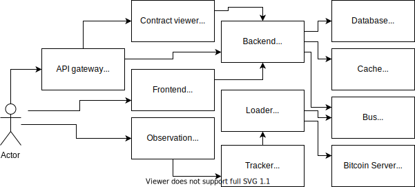

# Обозреватель цепочки блоков

## Описание
Домашняя работа, 
посвященная изучению микросервисной архитектуры, 
выполняемая в рамках курса«Архитектор программного обеспечения»

## Постановка задачи

### Общая
Разработать сервис, позволяющий пользователю хранить кошельки и отслеживать баланс своего кошелька, 
представленный как разница полученых доходов и списанных расходов для принадлежащих пользователю адресов 

### В рамках первой части домащней работы
Разработать сервис, имеющий следующие возможности:
* регистрация пользователя
* аутентификация пользователя
* создание кошелька пользователя
* получение списка кошельков пользователя

### В рамках третьей части домащней работы
Разработать отдельный сервис загрузчик (Loader),
соединить с сервисом ответчиком (Backend) через шину межвзаимодействия (Bus)
и вывести концевые точки для получения баланса и порождение монет 
в сервис ответчик (Backend)

Сервис загрузчик должен иметь следующие возможности
* Получение блоков из корневого узла цепочки блоков
* Сохранение блоков в ключ-значение хранилище
* Подсчет баланса для заданного адреса
* Порождение основных монет в корневого узла для заданного адреса

### В рамках пятой части домащней работы
Разработать сервис фронтальной части (Frontend),
наладить основное одностороннее получение данных с сервиса ответчика (Backend) 
и обеспечить получение уведомлений с сервиса ответчика (Backend)

Сервис фронтальной части должен обеспечивать следующие возможности:
* Регистрация пользователя
* Вход пользователя
* Добавление кошелька пользователя
* Отображение кошельков пользователя
* Отображение баланса в рельном времени

### В рамках седьмой части домащней работы
Подключить сторонний сервис кеширования (Cache),
наладить получение и задание кеша баланса при запросе на сервисе ответчике (Backend) 
и обеспечить обновление кеша баланса при получении новых блоков на сервисе ответчике (Backend)

Сервис кеширования  должен обеспечивать следующие возможности:
* Сохранение баланса после его единократного получения
* Обновление сохраненного баланса после прибытия новых поступлений

### В рамках восьмой части домащней работы
Подключить сторонние сервисы слежения (Tracker) и наблюдения (Observation),
наладить получение данных от сервиса загрузки (Loader) на сервисе слежения (Tracker)
и обеспечить отображенния отслеживаемых данных на сервисе наблюдения (Observation).

Сервис слежения должен обеспечивать следующие возможности:
* Регулярное получение и сохранение количества загруженных блоков 

Сервис наблюдения должен обеспечивать следующие возможности:
* Отображение изменения количества загруженных блоков с течением времени

## Архитектура проекта



Backend отвечает за формирование ответов на запросы.

Сache отвечает за временное хранение вычисленных ранее значений (например баланса).

Fronend отвечает за отображение фронтальной части сервиса.

Loader отвечает за выгрузку блоков из корневых узлов цепочки блоков (blockchain)

Bus представляет из себя шину межвзаимодействия.

Bitcoin Server представляет из себя корневой узел цепочки блоков.

Contract viewer отвечает за отображение контракта Backend'а.

Database отвечает за хранение кошельков пользователей.

Tracker отвечает за получение и хранение значений количества загруженных блоков 
в течение отслеживамого периода времени.

Observation отвечает за отображение значений количества загруженных блоков 
в течение отслеживамого периода времени.


## Описание контрактов

Запуск сервиса просмотра контракта

```
    docker-compose down
    docker-compose up gateway
```

Запущенный сервис отображения контракта находится по адресу `http://localhost/swagger/`.

## Выполнение ручной проверки

### Предварительные действия

установка http клиента (нет никаких препятствий для использования cUrl)
```
    apt-get install httpie
```

Запуск сервисов обозревателя
```
    docker-compose down
    docker-compose up backend loader frontend
```

### Cоздание и получения кошелька
```
    http --session=backend -v http://localhost/signup email=user@site.net password=12345678

    http --session=backend -v http://localhost/signin email=user@site.net password=12345678

    http --session=backend -v http://localhost/wallets address=2NEmNpj2iW7xGw6ndUpZNrAeRz765PStNGP

    http --session=backend -v http://localhost/wallets 
```

### Проверка баланса
```
    http --session=backend -v http://localhost/balance address=2NEmNpj2iW7xGw6ndUpZNrAeRz765PStNGP 
```

### Порождение монет для заданного кошелька и получение его баланса

```
    http --session=backend -v http://localhost/generate address=2NEmNpj2iW7xGw6ndUpZNrAeRz765PStNGP 
    
    http --session=backend -v http://localhost/balance address=2NEmNpj2iW7xGw6ndUpZNrAeRz765PStNGP 
```

### Получение баланса кошелька в реальном времени

откройте в обозревателе адрес лицевой части сервиса

```
    chrome http://localhost:3000/
```

зарегистрируйтесь, войдите и добавьте желаемый кошелек, например 2NEmNpj2iW7xGw6ndUpZNrAeRz765PStNGP

выполните порождение монет для желаемоего кошелька 
```
    http --session=backend -v http://localhost/generate address=2NEmNpj2iW7xGw6ndUpZNrAeRz765PStNGP 

```

### Сохранение ранее вычисленного баланса кошелька

Выполните действия по получению баланса кошелька в реальном времени

После этого перезагрузите страницу и снова войдите.

Процесс получения кошельков должен пройти ощутимо быстрее

### Отслеживание количества загруженных блоков

откройте в обозревателе адрес систесы наблюдения grafana
имя пользователя admin.
пароль пользователя admin.

```
    chrome http://localhost:3001/d/aO7KY1CWk/prometheus?orgId=1&from=now-15m&to=now&refresh=5s

```
и выполните порождение монет для произвольного кошелька 
```
    http --session=backend -v http://localhost/generate address=2NEmNpj2iW7xGw6ndUpZNrAeRz765PStNGP 

```

## Запуск самопроверки
```
    docker-compose run backend-test
```
