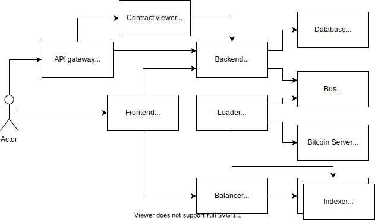

# Обозреватель цепочки блоков

## Описание
Домашняя работа, 
посвященная изучению микросервисной архитектуры, 
выполняемая в рамках курса«Архитектор программного обеспечения»

## Постановка задачи

### Общая
Разработать сервис, позволяющий пользователю хранить кошельки и отслеживать баланс своего кошелька, 
представленный как разница полученых доходов и списанных расходов для принадлежащих пользователю адресов 

### В рамках четвертой части домащней работы
Описать сервис распределения нагрузки (Balancer).

Сервис распределения нагрузки должен обеспечивать следующие возможности:
* Перенаправление запросов от сервис фронтальной части (Frontend) к сервису индексации (Indexer)
* Распределять перенаправляемые запросы опираясь на функцию шардирования (описана ниже)

Сервис загрузчик должен иметь следующие возможности
* Сохранение блоков в сервисе индексации (Indexer)
* Сохранение транзакций в сервисе индексации (Indexer)
* Сохранение адресов в сервисе индексации (Indexer)

## Архитектура проекта

Indexer отвечает за индексацию блоков, транзакций и адресов, 
получаемых от сервиса загрузки (Loader).

Balancer отвечает за перенаправление поисковых запросов 
от сервиса фронтальной части (Frontend)
на сервису индексации (Indexer), 
который содержит искомую информацию
при использовании функции шардирования.

Backend отвечает за формирование ответов на запросы.

Frontend отвечает за отображение фронтальной части сервиса.

Loader отвечает за выгрузку блоков из корневых узлов цепочки блоков (blockchain)
разбор полученных блоков 
и отправку отдельных блоков, транзакций и адресов в сервис индексации (Indexer).

Bus представляет из себя шину межвзаимодействия.

Bitcoin Server представляет из себя корневой узел цепочки блоков.

Contract viewer отвечает за отображение контракта Backend'а.

Database отвечает за хранение кошельков пользователей.

## Описание шардирования

### Функция шардирования
Выбор отдельного шарда для записи или чтения 
выбирается на основе последнего символа в идентификаторе экземпляра.

Данным идентификатором является 
хеш для транзакции или блока 
и значение самого адреса для адреса.

Порядковый номер шарда вычисляется 
как остаток от деления 
числового представления последнего символа строки идентификатора
поделенного на количество шардов
